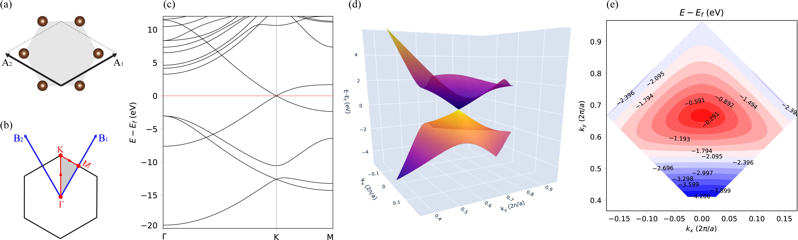
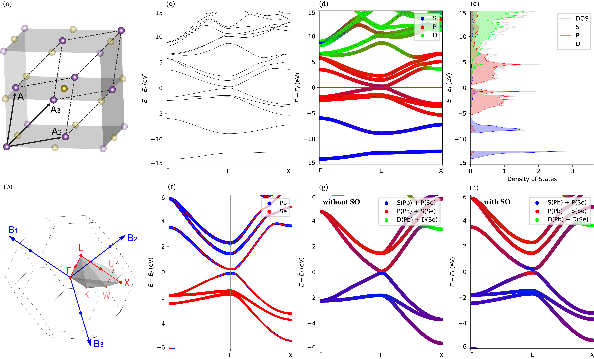
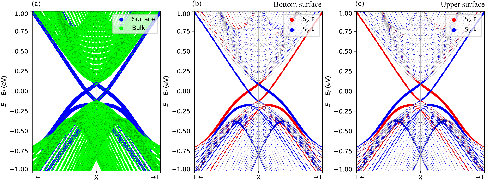
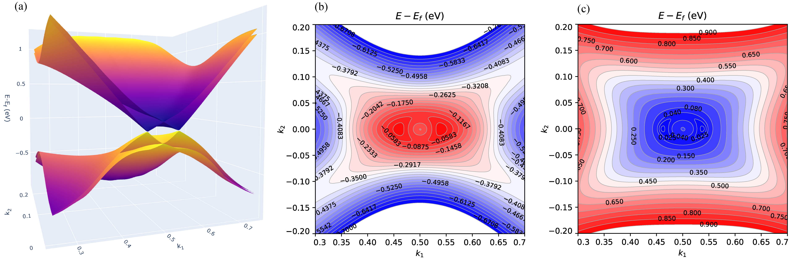

# VASProcar Copyright (C) 2023   -   GNU GPL-3.0 license

VASProcar is an open-source package written in the Python 3 programming language, which aims to provide an intuitive tool for the post-processing of the output files produced by the DFT VASP code, through an interactive user interface.

VASProcar extracts information and results from the following VASP output files (CONTCAR, KPOINTS, OUTCAR, PROCAR, DOSCAR, LOCPOT, PARCHG and vasprun.xml).

Please use the following DOI ([10.5281/zenodo.6343960](https://doi.org/10.5281/zenodo.6343960)) to cite the use of the code in publications.


### Repositories:  [ZENODO](https://doi.org/10.5281/zenodo.6343960), [GitHub](https://github.com/Augusto-de-Lelis-Araujo/VASProcar-Python-tools-VASP), and [PyPi](https://pypi.org/project/vasprocar)

------------------------------------------------------------------------

## Installation

-  Requirements

    - [Numpy](https://pypi.org/project/numpy/)
    - [Scipy](https://pypi.org/project/scipy/)
    - [Matplotlib](https://pypi.org/project/matplotlib/)
    - [Plotly](https://pypi.org/project/plotly/)
    - [Moviepy](https://pypi.org/project/moviepy/)
    - [Kaleido](https://pypi.org/project/kaleido/)
    
- Using Pip:

  ```bash
  pip install --upgrade vasprocar
  ```

- Manual Installation:

  ```bash
  python manual_installation.py
  ```

- Run Code:

  ```bash
  python -m vasprocar
  ```
------------------------------------------------------------------------

For more informations/questions send an e-mail to: augusto-lelis@outlook.com

------------------------------------------------------------------------


Figure 1) Graphene monolayer: (a) Crystal lattice unit cell, (b) 1º Brillouin zone, and (c) Band structure, (d) 3D plot of band structure, and (e) Levels contour.
------------------------------------------------------------------------

Figure 2) PbSe bulk under pressure: (a) Crystal lattice unit cell, (b) 1º Brillouin zone, (c) Band structure, (d) Projection of orbitals, (e) Density of states, (f) projection of the Pb/Se contribution, and Projection of the character of states without (h) and with (i) SO.
------------------------------------------------------------------------

Figure 3) Projection of bulk and surface states (a) and spin textures on the upper (b) and lower (a) surface of the stacking of the PbSe under pressure.
------------------------------------------------------------------------

Figure 4) 3D plot of the band structure of PbSe stacking under pressure (a) and Level Contours of the valence (b) and conduction (c) bands.
